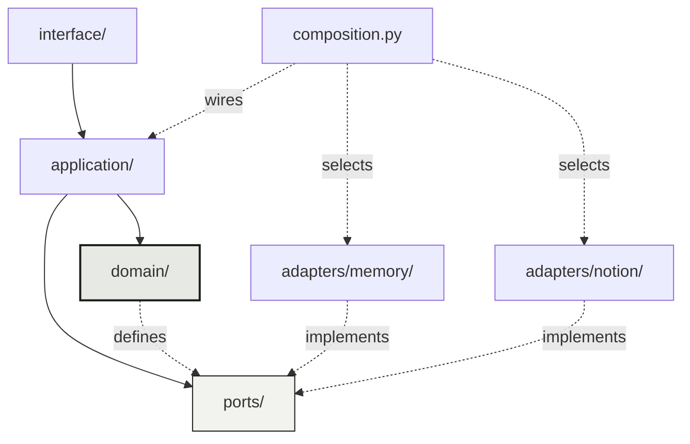
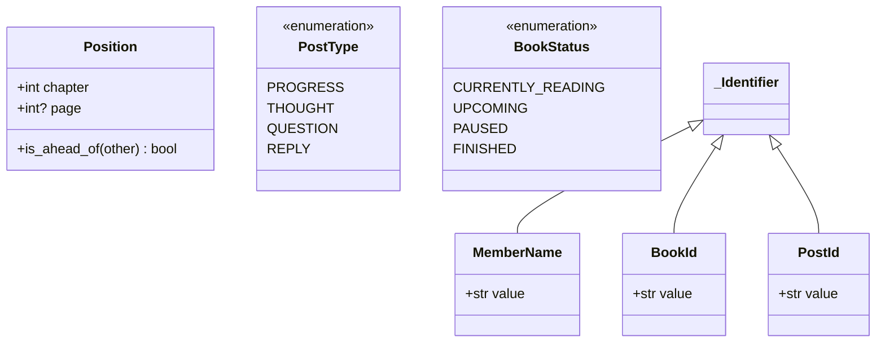
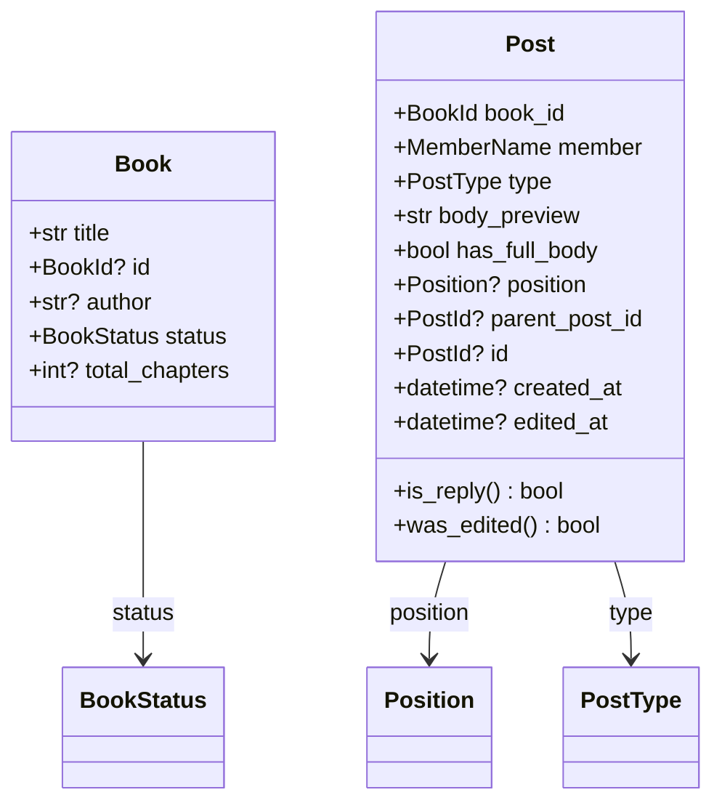
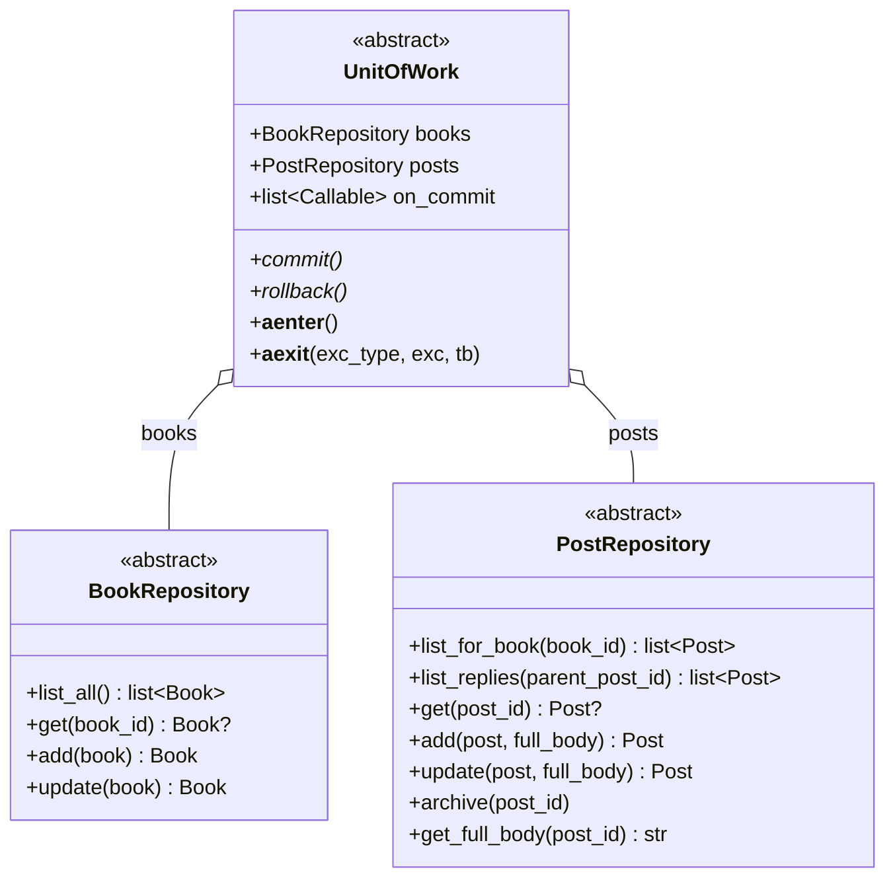
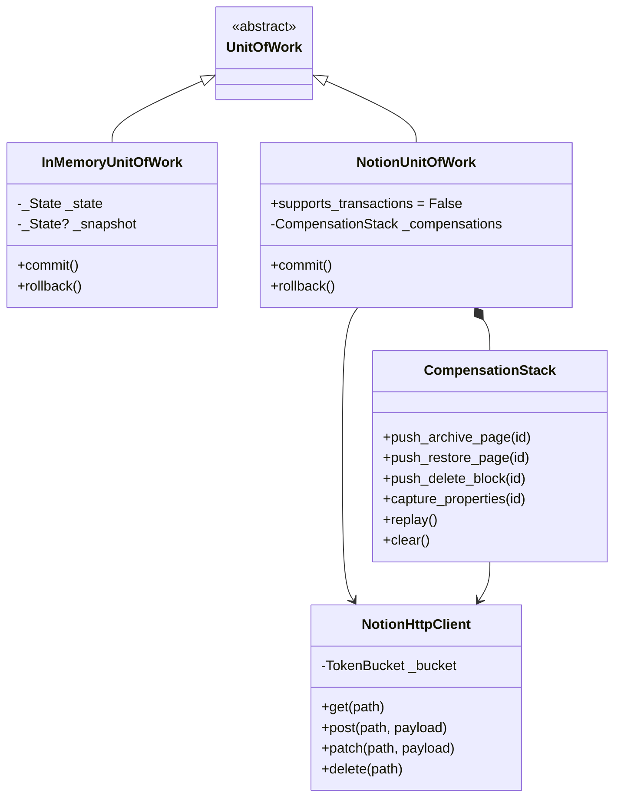
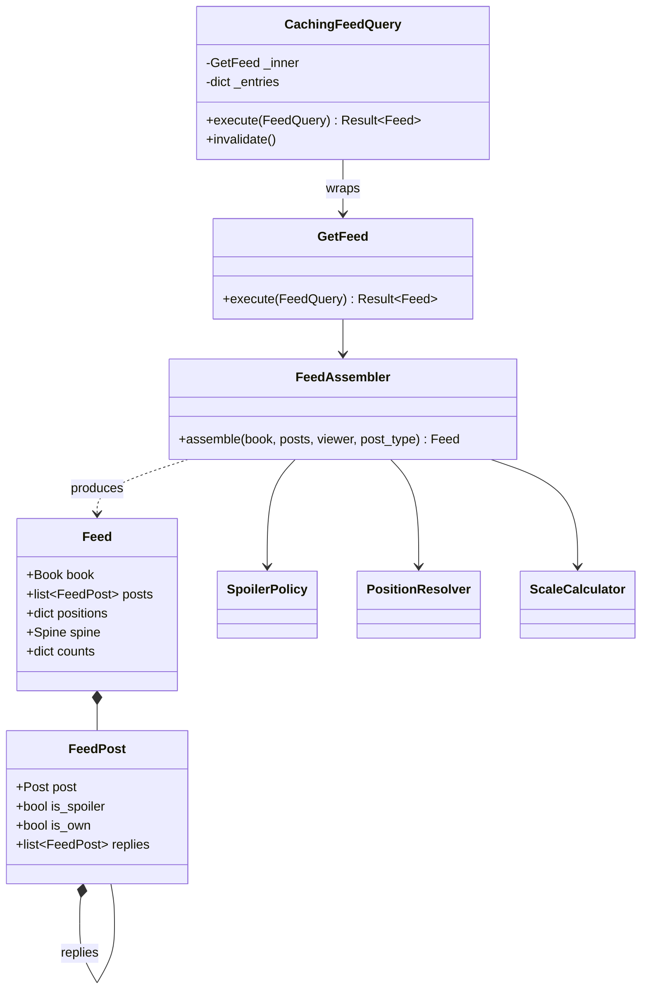
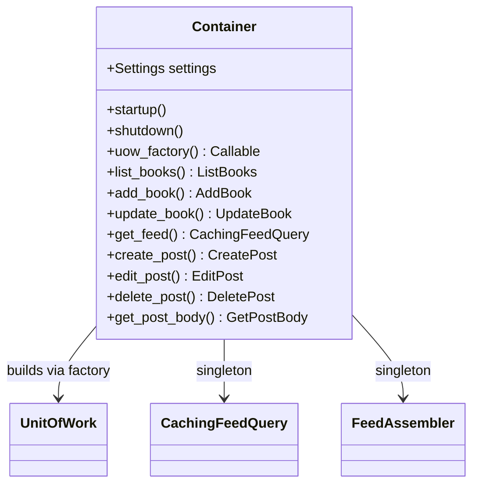
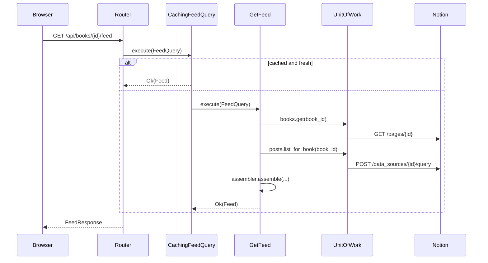
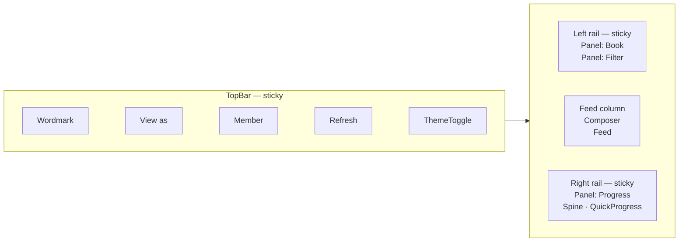
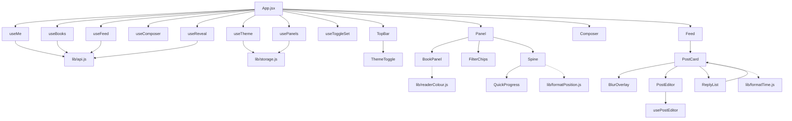

# Reading the codebase

A guided tour, ordered so that each section depends only on what came before.
Following it end to end takes about an hour and leaves you able to place any
file in the tree.

If you only need to make one change, jump to [§8](#8-where-to-make-a-change).

---

## 1. Orientation

```text
book-club-mini/
├── backend/
│   ├── app/
│   │   ├── domain/          entities, value objects, policies, services
│   │   ├── ports/           repository and unit-of-work abstractions
│   │   ├── application/     use cases, feed assembly, caching
│   │   ├── adapters/
│   │   │   ├── memory/      in-memory implementation, used by tests
│   │   │   └── notion/      HTTP client, mappers, repositories, unit of work
│   │   ├── interface/       FastAPI routers, DTOs, error mapping
│   │   ├── composition.py   the dependency-injection container
│   │   ├── config.py        settings
│   │   └── main.py          application factory and lifespan
│   ├── scripts/             operator tools, not part of the application
│   └── tests/               unit, contract, integration, api, architecture
├── frontend/src/
│   ├── lib/                 pure helpers
│   ├── hooks/               all state, derivation and formatting
│   ├── components/          presentational only
│   └── styles/              design tokens and component styles
└── docs/
```

The single most useful fact about this tree: **dependencies point inward only.**



`domain/` imports nothing from the other layers. `application/` imports the
domain and the ports, never an adapter. Adapters are reached only through
`composition.py`.

This is enforced, not merely intended — `tests/architecture/` walks the import
graph with the `ast` module and fails the build on a violation. Start there if
you want the rule in executable form.

---

## 2. The domain

Read in this order. Every file is pure Python with no I/O and no framework.

### `domain/result.py`

`Ok` and `Err`, frozen generics with `is_ok`, `unwrap`, `unwrap_err`, `map`.
Every use case returns one.

### `domain/errors.py`

The expected-failure taxonomy. `DomainError` is **not an exception** — raising
one is impossible, so the only way to signal an expected failure is to return
it. Each subclass carries a stable `code`, which the interface layer maps to an
HTTP status.

### `domain/values.py`



The identifier wrappers are frozen dataclasses, not type aliases. Distinct
subclasses never compare equal, so passing a `BookId` where a `PostId` belongs
fails at runtime — the project runs no type checker, so the guard has to be
real.

`Position.is_ahead_of` is the whole ordering rule and the only place it exists.
Note what is absent: no `__lt__`. Two positions in the same chapter where one
page is missing are genuinely incomparable, and an operator would be forced to
invent an answer.

### `domain/entities.py`



`id`, `created_at` and `edited_at` are nullable because an entity being created
has none of them yet; the repository returns a populated copy.

The `__post_init__` guards raise `ValueError`. That is not how expected failures
are reported — it is a last-line assertion against a programming error. Use
cases validate input and return `Err` *before* constructing anything, so real
input never reaches these.

`was_edited` compares against a 60-second threshold rather than testing
equality. Creating a long post is a page write followed by a block append, and
the append moves `last_edited_time`; without the threshold every long post would
be born marked as edited.

### `domain/policies.py`

`SpoilerPolicy` is an abstract base with one method;
`ChapterFirstSpoilerPolicy` is the only implementation. It delegates the
comparison to `Position.is_ahead_of` rather than reimplementing it.

Isolated as a strategy because the blur rule is the most likely thing here to
change: a percentage-based variant would be a new class, not a branch.

### `domain/services.py`

Three stateless services:

| Service | Responsibility |
| --- | --- |
| `PositionResolver` | Latest progress post per member, not highest |
| `BodySplitter` | `(preview, has_full_body, full_body)` |
| `ScaleCalculator` | `(max_chapter, is_estimated)` for the spine |

`tests/unit/domain/` reads as the specification for all of the above. If you
want the rules rather than the implementation, read the test names.

---

## 3. Ports

Two repositories and a unit of work, declared next to the domain that needs
them rather than next to the code that satisfies them.



Four things to notice:

- **Methods speak in entities.** No dictionaries, no property names. Notion's
  shapes stop at the mapper.
- **`full_body` is a parameter, not a field on `Post`.** The entity carries the
  preview and a flag; the complete text is a lazily fetched detail. Keeping it
  off the entity is what structurally prevents the feed from loading every body.
- **`__aexit__` rolls back on an exception and never auto-commits.** An implicit
  commit on a use case that returned `Err` would be a defect waiting to happen.
- **`on_commit`** holds callbacks fired after a successful commit and never
  after a rollback. The container registers cache invalidation there, which is
  how invalidation happens in one place instead of at eight call sites.

---

## 4. Adapters

Two implementations of the same three abstractions.



### `adapters/memory/`

State lives in dicts on a shared `_State`; `__aenter__` snapshots it and
`rollback` restores it, giving real transactional semantics. Archived posts are
flagged rather than removed, because Notion behaves that way and a fake that
hard-deletes would let a defect through.

The clock is injected. Tests that assert on ordering need control of time, and a
hidden `now()` is the usual reason such tests turn flaky.

`_State.calls` records every repository call, which is how tests assert a
request was *not* made without reaching for a mocking library.

### `adapters/notion/`

| Module | Responsibility |
| --- | --- |
| `http.py` | One `httpx` client, token-bucket rate limiting, retry policy, error wrapping |
| `ids.py` | `database_id` → `data_source_id`, memoised |
| `rich_text.py` | Chunking at 2,000 characters, property readers |
| `mappers.py` | Notion pages ↔ entities; the only place property names appear |
| `repositories.py` | Query shape, pagination, the four body-update transitions |
| `unit_of_work.py` | Compensating rollback |

Two points deserve attention when reading.

**Data sources, not databases.** Since API version `2025-09-03` a database is a
container holding one or more data sources, and rows live on the data source.
Rows are queried at `/v1/data_sources/{id}/query` and created with
`parent: {"type": "data_source_id", ...}`. The identifier in a Notion URL is the
*database* identifier, resolved once at startup. The two are not interchangeable
and sending one where the other belongs is this API's signature mistake — which
is why the integration tests assert on outbound requests, not just responses.

**The four body transitions.** Updating a post must handle every combination of
short and long:

| Was | Becomes | Action |
| --- | --- | --- |
| short | short | patch properties only |
| short | long | patch properties, **append** a block |
| long | long | patch properties, **update** the existing block |
| long | short | patch properties, **delete** the block |

An implementation handling only the first and third passes a casual review and
fails the contract suite.

---

## 5. Application

Every use case is a class with a single `execute`, receives collaborators through
constructor injection, and returns `Result`.



`CachingFeedQuery` implements the same interface as `GetFeed` and wraps an
instance of it, so assembly stays free of cache concerns and every assembler
test runs without cache interference. The key is `(book, viewer, filter)` — the
viewer must be included, because blur flags are computed per viewer and a key
without it would serve one member's flags to the other through **View as**.

Three assembly rules that a reasonable implementation gets wrong:

- **The type filter runs after nesting**, never in the query. Filtering at the
  source would strip replies from the posts that survive.
- **Positions include every roster member**, null for anyone with no progress
  post. "Hasn't started" is a state the spine renders, and it cannot render it
  for a member absent from the mapping.
- **Replies are flagged independently** rather than inheriting their parent's
  flag. Revealing a parent must not silently reveal replies.

The remaining use cases live one per module in `application/use_cases/`.
`create_post.py` is the most rule-dense and the best single file for
understanding the domain's constraints.

---

## 6. Interface and composition



The container is hand-written rather than framework-driven. Its real
justification is that the object graph must be constructible from HTTP handlers,
from tests and from scripts — dependency injection through the web framework
covers only the first.

The `uow_factory` parameter is the seam: passing an in-memory factory builds the
entire graph with no HTTP at all, which is what the API tests and the operator
scripts use.

### Routes

| Method | Path | Use case |
| --- | --- | --- |
| `GET` | `/api/health` | — |
| `GET` | `/api/me` | — |
| `GET` | `/api/books` | `ListBooks` |
| `POST` | `/api/books` | `AddBook` |
| `PATCH` | `/api/books/{book_id}` | `UpdateBook` |
| `GET` | `/api/books/{book_id}/feed` | `CachingFeedQuery` |
| `POST` | `/api/posts` | `CreatePost` |
| `PATCH` | `/api/posts/{post_id}` | `EditPost` |
| `DELETE` | `/api/posts/{post_id}` | `DeletePost` |
| `GET` | `/api/posts/{post_id}/body` | `GetPostBody` |

A router does three things: parse the DTO, call one use case, map the `Result`.
Anything else is misplaced.

`interface/schemas.py` holds Pydantic DTOs kept deliberately separate from
domain entities, so the domain never grows framework configuration and the API
does not break when a domain field is renamed.

`interface/errors.py` is one table from `DomainError.code` to HTTP status. An
architecture test asserts every error subclass appears in it, because the
default for an unmapped error would be a silent `500`.

### A request end to end



One query per feed load plus one book read, and no per-post requests. That last
clause is what the rate limit makes load-bearing, and a test asserts it.

---

## 7. Frontend

One rule shapes this layer:

> **All state, derivation and formatting live in hooks and pure functions.
> Components are thin and presentational.**

Components hold no logic, so any logic put inside one is untested by
construction. "I want to test this component" is the signal to extract a hook.

### Layout

Three columns. The feed keeps a reading measure of about 680px; the space that
measure leaves over holds the standing context, in reach without scrolling and
without pushing the first post below the fold.



Below 1200px it becomes two columns — one rail beside the feed holding all
three panels. Splitting the rails across the top instead leaves a ragged,
half-empty band above the feed, because the two are never the same height.
Below 760px everything stacks and the spine lies down. Orientation is the
stylesheet's business: a tick's distance along the track is written as a
`--pos` custom property, and the media query decides whether that is a distance
down or across.

A post's preview runs to the storage layer's field limit — around thirty lines,
which is one post filling the screen. The feed clamps a long body to eight and
offers to open it. Whether opening costs a request depends on why it is long:
`lib/truncation.js` separates a post whose remainder is in a body block from
one that is merely long and already on the page.

### Components



`Panel` is the collapsible section used by all three rail panels. `PostCard`
renders either a body or an editor, never both — which is what puts an edit in
the card being edited rather than at the end of the page.

| Hook | Holds |
| --- | --- |
| `useMe` | Member, roster, colour index |
| `useBooks` | List, selection, add, update |
| `useFeed` | Load, refresh, filter, error, optimistic insert |
| `useComposer` | Type, fields, prefill, validation, submit |
| `usePostEditor` | One post's edit: fields, full-body fetch, save |
| `useReveal` | Per-post reveal and expand state |
| `useTheme` | Light or dark, and whether the system still decides |
| `usePanels` | Which rail panels are open; persisted |
| `useToggleSet` | Collapsed reply threads |

### Theme

`useTheme` follows the operating system until the member touches the toggle;
the first toggle is recorded and the system is no longer consulted. It writes
`data-theme` onto `<html>`, and `tokens.css` redefines the same custom
properties under `[data-theme='dark']` — no component knows which theme is
active.

`index.html` runs the same resolution rule inline before the bundle loads.
Without it the page paints light and then flips, one frame late, on every
reload. The duplication is deliberate and the two must be changed together.

Dark is not the light palette inverted. The grounds keep their green cast, and
the two reader colours are lifted rather than reused: they are the app's
primary wayfinding, and deep petrol on a dark ground is unreadable.

### Behaviour worth reading closely

Two in `useFeed`:

- **Refresh never blanks the feed.** On error the existing posts stay; only the
  error field changes.
- **Focus refreshes are deduplicated.** A request in flight suppresses further
  ones, which is what stops a rapid alt-tab loop from stacking queries.

Filtering is client-side. The feed response carries counts for all four chips,
so filtering at the server would cost the counts of the types it filtered out —
and every chip click would cost a request.

`lib/spineScale.js` intentionally duplicates the backend's `ScaleCalculator`,
for optimistic updates after posting. Its test file runs the same cases as the
Python test to keep them honest; if they ever disagree, the correct resolution
is to delete the frontend copy and render only what the API sends.

---

## 8. Where to make a change

| Task | File |
| --- | --- |
| Change the blur rule | `domain/policies.py`, or add a new `SpoilerPolicy` |
| Change how position is derived | `domain/services.py` → `PositionResolver` |
| Change the spine scale | `domain/services.py` → `ScaleCalculator` **and** `frontend/src/lib/spineScale.js` |
| Add a field to a post | `domain/entities.py`, then `adapters/notion/mappers.py`, then `interface/schemas.py` |
| Add a validation rule | The relevant use case in `application/use_cases/` |
| Add an endpoint | `interface/routers/api.py` plus a use case |
| Add a domain error | `domain/errors.py` **and** `interface/errors.py`; the architecture test fails otherwise |
| Change Notion request shape | `adapters/notion/repositories.py` |
| Change the cache lifetime | `application/caching.py` |
| Change a colour or font | `frontend/src/styles/tokens.css`, nowhere else — both themes |
| Change the page layout | `frontend/src/styles/app.css` → `.columns` and its media queries |
| Add a rail panel | A `<Panel>` in `App.jsx`; `usePanels` needs no change |
| Add UI state | A hook, never a component |
| Replace the database | A new adapter package — see [storage-backends.md](storage-backends.md) |

---

## 9. The test suite as documentation

| Directory | Contents |
| --- | --- |
| `tests/unit/` | Domain and application. No I/O, no mocks of our own code |
| `tests/contract/` | One suite, run against every port implementation |
| `tests/integration/` | Notion adapter against recorded responses and a stateful stub |
| `tests/api/` | Routers in-process against in-memory adapters |
| `tests/architecture/` | Import direction, error-map completeness, use-case shape |

**`tests/contract/test_unit_of_work_contract.py` is the most valuable file in
the repository.** One abstract class defines the behaviour every persistence
implementation must exhibit; each implementation subclasses it and supplies a
fixture. It is what makes the in-memory adapter trustworthy as a substitute
everywhere else, and it is the substitutability check for the whole port design.

Three tests carry a `fake_only` marker: true rollback semantics, which a store
without transactions cannot provide. The marker is keyed on a declared
`supports_transactions` capability rather than a class name, so an
implementation that has transactions runs them automatically.

On the frontend, `src/hooks/` and `src/lib/` carry a ≥90% floor and components
are excluded. One component test exists — `src/test/app.test.jsx` — which mounts
the whole app against MSW and asserts the pieces are wired together and
reachable. It was added after a redesign in which every hook test passed while
the edit form rendered at the foot of the page instead of in the post being
edited. It queries by role and label, never by class.

Coverage floors are 100% line **and branch** on `domain/` and `application/`,
and ≥90% on `adapters/` and `interface/`. The stricter target applies only where
the code is pure and the target is achievable without contortion; chasing 100%
on HTTP adapters produces tests that assert a mock was called, which is worse
than the gap.

---

## Related reading

- [domain-model.md](domain-model.md) — the rules, independent of any technology
- [decisions.md](decisions.md) — one entry per pattern, and what would have to
  change for it to be removed
- [storage-backends.md](storage-backends.md) — replacing the persistence layer
