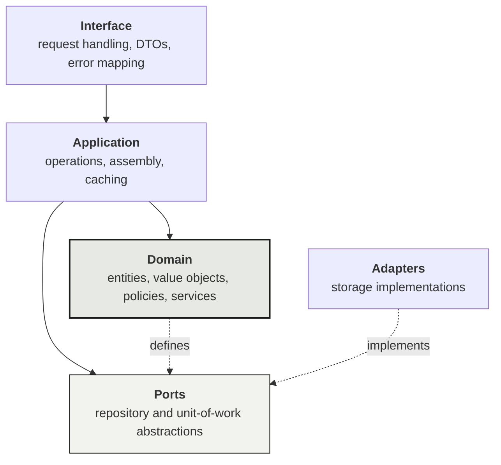
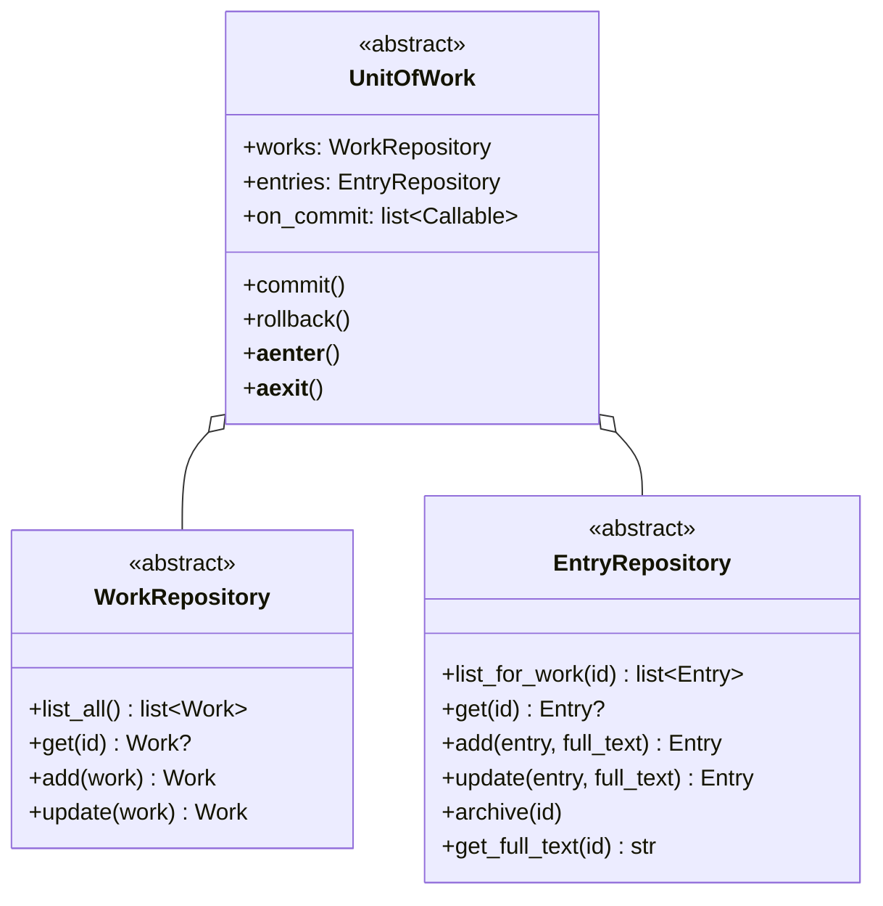

# Domain model and architecture specification

This document defines the problem domain, its entities and invariants, and the
architecture that implements them. It is deliberately free of technology names:
nothing here depends on a particular storage engine, web framework or user
interface toolkit.

For the concrete stack currently in use, see [overview.md](overview.md).

---

## 1. The problem

A small, closed group of readers works through the same written work at
different speeds. Each reader records where they are and writes commentary as
they go. Commentary that refers to material a given reader has not yet reached
must not be shown to that reader by accident.

The domain therefore has to answer three questions:

1. **Where is each reader?** A position that is asserted rather than inferred.
2. **What has been said, and from where?** Commentary anchored to a position.
3. **What may each reader see?** A comparison between the two.

Everything else — composition, editing, threading, presentation — is in service
of those three.

## 2. Bounded context

The model covers a single reading group with a shared library. It does not model
identity, authorisation, notification, discovery or social graph. Readers are
known to the system as a fixed roster supplied at configuration time.

The group is assumed to be small enough that:

- the full commentary for one work fits comfortably in memory;
- there is no meaningful write contention;
- eventual visibility of another reader's writes is acceptable.

These assumptions are load-bearing. Section 9 states what breaks first when they
stop holding.

---

## 3. Entities

### Work

A single readable item that commentary attaches to.

| Attribute | Type | Required | Notes |
| --- | --- | --- | --- |
| `id` | identifier | assigned on persist | Absent before first persist |
| `title` | text | yes | The only required attribute |
| `author` | text | no | |
| `status` | enumeration | yes | Defaults to *pending* |
| `length` | positive integer | no | Total divisions, if known |

**Invariants**

- A title is present and not blank.
- Length, if given, is at least 1.

**Status** is one of *active*, *pending*, *suspended*, *complete*. **At most one
work in the library is active at a time.** Activating a work suspends any other
active work; it does not complete it. The system cannot distinguish "finished
reading" from "set aside", and inferring either would record a claim the reader
never made.

### Entry

A unit of commentary.

| Attribute | Type | Required | Notes |
| --- | --- | --- | --- |
| `id` | identifier | assigned on persist | Absent before first persist |
| `work_id` | identifier | yes | |
| `author` | reader | yes | |
| `kind` | enumeration | yes | See below |
| `excerpt` | text | yes, may be empty | Bounded; see §6 |
| `has_full_text` | boolean | yes | Whether a longer body exists |
| `position` | position | conditional | Required for *progress* entries |
| `parent_id` | identifier | no | Present on responses only |
| `created_at` | timestamp | assigned on persist | |
| `edited_at` | timestamp | assigned on persist | |

**Kinds** are *progress*, *observation*, *inquiry* and *response*.

**Invariants**

- A *progress* entry carries a position. That is what makes it a progress entry.
- An entry with a parent has kind *response*, and one without does not.
- The excerpt does not exceed the excerpt bound.

Invariants that require inspecting a *different* entity — that a parent is not
itself a response, that a parent belongs to the same work — are not entity
invariants. An entity cannot see its parent. They belong to the operations in
§7.

---

## 4. Value objects

### Position

An ordered location within a work: a required **division** (a chapter or
equivalent) and an optional **offset** (a page or equivalent).

Position exposes a single ordering operation, `is_ahead_of`, and deliberately
does **not** implement a total order:

```
is_ahead_of(other):
    division ≠ other.division  →  division > other.division
    either offset is absent    →  false
    otherwise                  →  offset > other.offset
```

Division dominates because offsets are not comparable across editions of the
same work — two readers may hold different printings, or one may be consuming an
audio edition with no offsets at all. Two positions in the same division where
one offset is missing are **genuinely incomparable**. A named predicate that
returns false for "cannot tell" is honest; a comparison operator would be forced
to invent an answer.

Returning false in the ambiguous case is also the safe direction: within a
single division, a needless concealment is more irritating than a mild
disclosure.

### Identifiers

Reader names and entity identifiers are distinct wrapper types rather than bare
strings, validated non-empty on construction. Distinct wrapper types never
compare equal, so passing a work identifier where an entry identifier belongs
fails at the boundary rather than silently reading the wrong record.

---

## 5. Policies

### Concealment

Whether an entry should be withheld from a reader is a strategy with one
parameter set — the entry, the viewer, and the viewer's position — and one
implementation:

```
entry author is the viewer      →  visible
viewer position unknown         →  visible
entry has no position           →  visible
otherwise                       →  concealed if entry.position.is_ahead_of(viewer.position)
```

Three of those four rules are exemptions, and each exists for a reason:

- **Own entries** are never concealed. A reader cannot spoil themselves.
- **An unknown viewer position** conceals nothing. Concealing everything from
  someone who has not yet recorded a position makes a working system look
  broken; the correct response is to prompt them for a position.
- **An entry with no position** is never concealed. Its author chose not to
  anchor it, and that choice is respected without warning.

The comparison itself is delegated to `Position.is_ahead_of`. Two copies of an
ordering rule is how they drift apart.

This is isolated as a strategy because it is the single most likely rule in the
domain to change. A proportional variant ("conceal anything past 60% of the
work") is a new implementation, not a branch inside this one.

### Position resolution

A reader's current position is the position of their **most recent** progress
entry — not their highest.

A reader who mistypes division 40 for division 4 corrects it by recording a new
position. Under a highest-wins rule they would be stranded for the remainder of
the work with no way to go back. Recency is also the only rule that matches what
the reader means: the last thing they said is where they are.

Timestamp resolution may be coarse enough for two entries to tie. Ties resolve
by input order, deterministically, so that ordering never depends on iteration
order.

### Division bounds

An entry's division must fall inside the work it belongs to:

```
valid  ⟺  work states no length,  or  division ≤ stated length
```

A work that states no length admits any division: requiring a length before the
system is usable was rejected, and an unknown length cannot exclude anything.

The rule is enforced on every write, and a *response* is exempt because it
copies the position of the entry it answers, which was bounded when that entry
was written.

It also has to keep holding afterwards, so shortening a work below its existing
entries is refused rather than silently stranding them. Lengthening a work, or
clearing its stated length, can never exclude anything and is always allowed.

The consequence of omitting this rule is not cosmetic. Position resolution would
place the member at the out-of-range division, nothing would then be ahead of
them, and concealment would switch off for the entire work.

### Scale calibration

The visual scale of the progress indicator:

```
length known    →  (max(length, highest observed division), exact)
length unknown  →  (max(ceil(highest observed × 1.2), 10), estimated)
```

The *estimated* flag reports whether the work declared its own length, not
whether the number was adjusted. A stated length that an entry overshoots is
still not an estimate — the indicator's job is to stay honest about its source
while still containing every entry. An indicator that draws a marker past its
own end is worse than one that stretches.

Writing an entry past a stated length is refused (see *Division bounds* above),
and so is shortening a work below its existing entries, so an overshoot can only
reach the system through the datastore directly. That route stays supported,
which is why the calculation still tolerates one.

The floor of 10 applies only to the estimated branch. A known length of 3 is
drawn as 3.

---

## 6. Text storage

Entries carry two representations of their body:

- an **excerpt**, bounded and always loaded with the entry;
- an optional **full text**, unbounded up to a hard ceiling, loaded on demand.

`has_full_text` records which case applies, so that rendering a list never has
to probe each entry to discover whether its excerpt was truncated.

The excerpt and the full text **overlap**: the first *n* characters exist in
both. This redundancy is intentional. Storing only the remainder would require
reassembling a body from two sources on every read and every edit, which is
precisely how stored text becomes corrupted.

The full text is a parameter on the persistence operations, not an attribute of
the entity. Keeping it off the entity is what structurally prevents a list
rendering from loading every body.

Splitting prefers a word boundary and falls back to a hard cut when the text
contains no separator.

---

## 7. Operations

Each operation is a single unit of behaviour that validates its input, performs
its effect within one transactional scope, and returns either a value or a typed
failure. Operations never raise for outcomes that are part of their design.

| Operation | Effect |
| --- | --- |
| List works | Ordered by status group, then alphabetically within a group |
| Add work | Activating suspends any other active work |
| Update work | As above; other attributes are independent |
| Read feed | Assemble entries, positions, concealment flags and scale |
| Create entry | Validate, split text, persist |
| Edit entry | Owner only; recompute excerpt and full text |
| Delete entry | Owner only; cascade to responses |
| Read full text | Fetch on demand, or return the excerpt |

### Rules spanning multiple entities

- **Responses are flat.** Responding to a response is a failure, not a silent
  re-parent.
- **A response copies its parent's position** at creation, overwriting anything
  supplied. Copying rather than joining keeps concealment evaluation free of
  lookups: every entry can be judged on its own attributes alone.
- **A response must belong to its parent's work.**
- **Editing an entry does not alter positions already copied onto its
  responses.** A response's position is a snapshot of where the conversation
  started, not a live reference.
- **Deleting an entry deletes its responses.** Responses are removed *before*
  the parent, so that a partial failure leaves a visible parent missing some
  responses rather than an absent parent with orphaned children.

### Ownership

Edit and delete are restricted to the entry's author. In a deployment where each
installation asserts its own identity, this check prevents accidents, not
attacks. Documentation must state that plainly rather than implying a security
boundary.

### Assembly

Feed assembly nests responses under parents, orders parents newest-first and
responses oldest-first — a conversation reads downward inside a list that reads
upward — and computes concealment per entry.

Three assembly rules are easy to get wrong:

- **Filtering by kind happens after nesting, never in the query.** Filtering at
  the source would strip responses away from the parents that survive.
- **Positions include an entry for every roster member**, null for anyone who
  has not recorded one. "Has not started" is a state the indicator renders, and
  it cannot render it for a member absent from the result.
- **Responses are judged independently**, not inherited from the parent. They
  usually agree, since a response copies its parent's position — but revealing a
  parent must not silently reveal responses the reader has not chosen to see.

---

## 8. Architecture

### Layers



**Dependencies point inward only.** The domain imports nothing from the
application, interface or adapter layers. The application imports the domain and
the ports, never an adapter. The ports are declared beside the domain that needs
them, not beside the code that satisfies them — the direction of that import is
the entire point of the arrangement.

This is enforced by an automated check over the import graph, not by review.

### Ports

Two repository abstractions and one unit of work. Their methods accept and
return **domain entities**; storage-specific shapes stop at the mapper.



The two repositories stay separate even though one unit of work supplies both,
so that an operation which only reads works cannot reach entries.

### Consistency

Two operations are multi-step and must not half-apply: creating an entry with a
full text (record, then body) and deleting an entry (each response, then the
parent). The unit of work is the scope for both.

The port makes no promise of atomicity. An implementation over a store with
transactions provides real rollback. An implementation over a store without
transactions provides **compensating rollback**: each successful write pushes
its inverse onto a stack, and rollback replays that stack in reverse.

| Forward operation | Compensation |
| --- | --- |
| Create record | Archive record |
| Append body | Delete body |
| Update attributes | Restore captured previous attributes |
| Archive record | Restore record |

Compensation is best-effort. A compensation may itself fail, and a concurrent
reader may observe an intermediate state. Both consequences must be stated in
the implementation's own documentation, and every failed compensation must be
logged with enough detail for manual repair.

`commit` on a compensating implementation discards the stack; the writes are
already durable by then.

### Deletion

Records are archived, never destroyed, so that a mistaken deletion is
recoverable through the storage system's own facilities.

### Caching

Feed reads are wrapped by a short-lived cache. The cache key includes the work,
the filter **and the viewer**, because concealment flags are computed per
viewer; a key without the viewer would serve one reader's flags to another.

Any successful write invalidates the entire cache. The dataset is small and
selective invalidation is not worth the defect surface. Invalidation is
triggered from a single hook on the unit of work rather than at each call site,
so no operation can forget it.

### Composition

The object graph is assembled by an explicit composition root — a plain class
that constructs adapters, wires operations and exposes one accessor per
operation. Operations receive collaborators through constructor injection only:
no module-level singletons, no service locator, no operation reaching for the
container.

The composition root accepts an injected unit-of-work factory, which is what
allows the entire graph to be built against an in-memory store with no I/O.

---

## 9. Constraints and where they bind

| Constraint | Consequence in the design |
| --- | --- |
| Storage may rate-limit requests | One query per feed read, no per-entry fetches, a read-through cache, no polling |
| Storage may lack transactions | Compensating rollback behind the unit-of-work port |
| Storage may bound a text attribute | The excerpt/full-text split |
| Storage may paginate | Cursor following with a hard page cap and a warning at the cap |
| Timestamps may be coarse | Deterministic tie-breaking in position resolution |
| Records may be edited outside the system | Mapping is forgiving: unknown enumerations fall back, missing values become null, no external edit can fault a read |

The last is easy to overlook. When the storage system has its own editing
interface, every read must tolerate values the application would never write.

---

## 10. Verification strategy

| Layer | Approach | Target |
| --- | --- | --- |
| Domain, application | Unit tests against real objects and an in-memory store | 100% line and branch |
| Ports | One contract suite, run against every implementation | Every implementation passes |
| Adapters | Recorded responses and request assertions, no network | ≥90%, every error path |
| Interface | In-process requests against an in-memory store | ≥90%, every error mapping |
| Architecture | Import graph, error-map completeness, operation shape | Enforced, not reviewed |

The **contract suite** is the most valuable artifact. One abstract test class
defines the behaviour every port implementation must exhibit; each
implementation subclasses it and supplies a fixture. It is what makes an
in-memory store trustworthy as a substitute in every other test, and it is the
substitutability check for the whole port design.

Where implementations legitimately differ, the differing tests are marked with a
reason and skipped based on a **declared capability** of the implementation
rather than its name — so an implementation that regains the capability runs
those tests automatically.

---

## 11. Growth

The design anticipates four directions. Each is listed with the seam it would
use and the point at which it becomes worthwhile.

### Different storage

Implement the three ports in a new adapter package, point the composition root
at it, and run the contract suite. Nothing in the domain, application or
interface layers changes. A store with transactions replaces compensating
rollback with a real one and the capability-marked tests begin running.

See [storage-backends.md](storage-backends.md).

### More readers

The roster is a configuration list, and positions are already keyed by reader.
The constraints are presentational rather than structural: the concealment
indicator assigns colours by roster position and reads well for a handful of
readers, not dozens. Beyond roughly four, the indicator needs rethinking and
real identity becomes necessary.

### Deeper threading

Responses are flat by construction: a single nullable parent reference, a
one-level assembly step, and an explicit failure when responding to a response.
Arbitrary depth requires a recursive assembly step and a cycle guard, and the
copied-position rule needs revisiting — at depth, a snapshot of the root's
position stops being meaningful.

### Search

Not present. A store with real query capability makes it straightforward; the
assembly layer already receives a full entry list and would instead receive a
filtered one. The natural seam is a new repository method rather than a new
port.

### What each direction costs

| Direction | Domain | Application | Interface | Adapters |
| --- | --- | --- | --- | --- |
| Different storage | — | — | — | new package |
| More readers | — | — | — | — |
| Deeper threading | changed | changed | changed | — |
| Search | — | changed | changed | changed |

The table is the argument for the layering. Three of the four most likely
changes leave the domain untouched.
