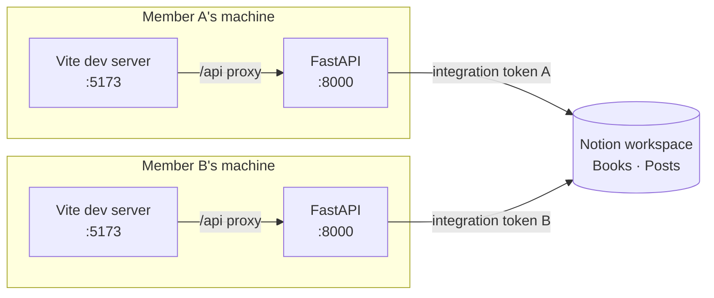

# Project overview

A self-hosted reading forum for a small, fixed group of readers working through
the same book. Members record where they are, write progress notes, thoughts and
questions as they read, and reply to one another. Any post anchored ahead of a
reader's own position is blurred for that reader until they choose to reveal it.

Notion is the database. Members can each run the full stack locally, meeting
only in the shared Notion workspace, or share one deployment — one setting
decides which, and the rest of this document is the same either way.

For the technology-independent specification of the domain and its
architecture, see [domain-model.md](domain-model.md).

---

## The data domain

Two record types, held in two Notion databases inside one shared page.

### Books

The library. One row per work.

| Field | Notion type | Purpose |
| --- | --- | --- |
| `Title` | Title | The only required field |
| `Author` | Text | Optional |
| `Status` | Select | `Currently Reading`, `Upcoming`, `Paused`, `Finished` |
| `Total Chapters` | Number | Optional; calibrates the progress indicator |

At most one book is `Currently Reading`. Setting a book current moves any other
current book to `Paused` rather than `Finished`, because the application cannot
distinguish a finished book from an abandoned one.

### Posts

Every unit of commentary, including replies.

| Field | Notion type | Purpose |
| --- | --- | --- |
| `Name` | Title | Generated human label, never parsed back |
| `Book` | Relation → Books | One-way |
| `Member` | Select | Author |
| `Type` | Select | `Progress`, `Thought`, `Question`, `Reply` |
| `Body Preview` | Text | Up to 1,900 characters |
| `Has Full Body` | Checkbox | Whether a longer body exists in a page block |
| `Chapter` | Number | Position, required on `Progress` |
| `Page` | Number | Optional tiebreaker within a chapter |
| `Parent Post ID` | Text | Plain text, empty for top-level posts |

Timestamps come from the Notion page object's built-in `created_time` and
`last_edited_time`; no timestamp fields are stored.

### Three schema decisions worth knowing

**`Parent Post ID` is plain text, not a self-relation.** A self-relation in
Notion creates a synced two-way property, which buys nothing for one-level
replies and adds a field to maintain.

**Replies copy their parent's chapter and page at creation.** Spoiler evaluation
then needs no joins: every post is judged on its own fields alone. The
consequence is that editing a parent does not move its replies — a reply's
position is a snapshot of where the conversation started.

**Bodies over 1,900 characters are split.** The preview lives in a Notion text
property, which caps at 2,000 characters; the complete body is additionally
written to a single paragraph block on the same page. The two overlap on
purpose, so a body is never reassembled from two sources. `Has Full Body` exists
so that rendering the feed never has to probe each post to discover whether its
preview was truncated.

---

## How the position and blur rules work

A member's position is the chapter and optional page on their **most recent**
`Progress` post — not their highest. A member who mistypes chapter 40 for
chapter 4 fixes it by posting again; a highest-wins rule would strand them.

A post is blurred for a viewer when all of the following hold:

- the viewer did not write it;
- the viewer has recorded a position;
- the post has a position;
- that position is ahead of the viewer's.

Chapter dominates the comparison. Page numbers only break ties within a single
chapter, and only when both are present, because two members may hold different
editions or one may be listening to an audiobook.

**A chapter must fall inside the book.** Where a book states a chapter count,
posting or editing past it is refused, and a book cannot be shortened below its
existing posts. Books with no stated count accept any chapter. This is not
cosmetic: an out-of-range progress update would place that member past every
post in the book, so nothing would be ahead of them and blurring would switch
off entirely.

Blurring is presentational. Author, position and timestamp stay sharp — knowing
that someone said *something* at chapter 9 is not a spoiler, and hiding the card
entirely would hide that the group is active. Revealing affects one post and
resets on reload.

---

## Current setup

### Stack

| Layer | Technology |
| --- | --- |
| Backend | FastAPI on Python 3.11+ |
| HTTP client | httpx |
| Configuration | pydantic-settings |
| Frontend | React 18 with Vite, plain JavaScript |
| Database | Notion REST API, version `2025-09-03` |
| Backend tests | pytest, pytest-asyncio, respx |
| Frontend tests | Vitest, Testing Library, MSW |

No ORM, no task queue, no cache server, no container runtime, no CSS framework,
no state management library, no client-side router. The dependency list is short
by intent; every addition is expected to justify itself against a stated
requirement.

### Topology

Each installation is complete and independent. They share only the Notion
workspace and know nothing of each other: there are no notifications and no
real-time updates. A member sees new activity by refreshing, which happens on
window focus and on an explicit control.

The Vite dev server proxies `/api` to the local backend, which puts both on one
origin. The backend therefore ships no CORS configuration, and a CORS error
during development indicates a misconfigured proxy rather than a missing header.

### Two integrations, one workspace

Each member holds their own Notion integration token. Notion applies rate limits
per integration, so two tokens give each member an independent budget, and
either can be revoked without affecting the other.

The workspace itself stays single-member. Notion applies a block limit to free
workspaces once a second person is invited, and the second reader needs no
Notion access — the integrations are the only writers.

### Identity

There is none, in the security sense. Each installation declares `MEMBER_NAME`
in its environment file and the backend attributes every post to that name.
Ownership checks on edit and delete prevent accidental interference between two
people sharing a screen; they are not an authorisation boundary and are
documented as such throughout.

A **View as** control re-renders the page as the other member. It changes only
which position drives the blur evaluation, never attribution.

### The interface

One screen, three columns. The feed holds a reading measure in the middle; the
book, the type filters and the progress spine occupy the space either side,
sticky, each in a collapsible section whose state is remembered. Below 1200px
the three sections gather into a single rail beside the feed; below 760px
everything stacks and the spine turns horizontal.

Long posts are clamped in the feed and open in place, so no single post can
crowd out the others.

Editing happens in the post being edited, replying under the post being replied
to, and a long post expands and collapses in place. Nothing that acts on one
post opens somewhere else on the page.

Light and dark themes both ship. The app follows the operating system until the
member uses the toggle, after which the choice is remembered. Colour is defined
once, as custom properties, and redefined for dark under an attribute on the
document element — no component knows which theme is in force.

### Operating constraints

Notion permits roughly three requests per second per integration and returns
`429` on overage. Every design choice around data access follows from that:

- one data source query per feed load, plus one book read;
- no per-post requests during rendering, which is what the preview/full-body
  split protects;
- a 20-second read-through cache, sized so repeated window focus does not
  translate into repeated queries;
- no polling;
- cursor pagination capped at five pages, with a warning at the cap.

Notion also provides no transactions. Multi-step writes — creating a long post,
deleting a post with replies — run inside a unit of work whose rollback is
implemented as compensating operations: each successful write pushes its inverse
onto a stack, replayed in reverse on failure. This is best-effort rather than
atomic, and failed compensations are logged at `ERROR` with enough context for
manual repair.

---

## Possibilities for growth

### Replacing Notion

The most anticipated change, and the one the architecture is shaped around.
Persistence sits behind three abstractions — two repositories and a unit of work
— defined next to the domain rather than next to the Notion code. A single
contract suite runs against every implementation.

Adding a PostgreSQL or MongoDB backend means writing one adapter package,
pointing the composition root at it, and running that suite. Nothing in the
domain, application or interface layers changes. A store with real transactions
also removes the compensating-rollback machinery and activates three contract
tests that are currently skipped.

[storage-backends.md](storage-backends.md) is a complete procedure for this.

### More readers

The roster is a configuration value and positions are already keyed by member,
so nothing structural stands in the way. The limits are presentational: reader
colours are assigned by roster index from a two-colour palette, and the progress
indicator reads well for a handful of ticks rather than dozens. Beyond about
four members, the indicator needs redesigning and real authentication becomes
necessary rather than optional.

### Deeper threading

Replies are flat by construction — one nullable parent field, a single nesting
pass, and an explicit error when replying to a reply. Arbitrary depth requires
recursive assembly with a cycle guard, and the copied-position rule needs
revisiting: at depth, a snapshot of the root's position stops being meaningful.

### Search

Absent. Notion's search API is workspace-wide and filters poorly, so the current
recommendation is to search in Notion directly. A backend with real query
capability makes this straightforward: the natural seam is an additional
repository method feeding a filtered list into the existing assembly step.

### Deployment

Supported, and it was the redesign this section used to say it would be rather
than a packaging exercise. Identity was a configuration value, so two people
sharing one deployment would have been the same person — every post either
wrote attributed to whichever member the server was configured as.

Identity is now per request. `AUTH_MODE` selects where it comes from: a
configuration value for a process on one person's machine, or a signed cookie
for a deployment both reach. One shared passphrase gates the second, which is
proportionate to what the app has always assumed — that both members are
trusted and the checks exist to prevent accidents.

What remains presentational is the preview. A post's first 1,900 characters
reach the browser whether or not they are blurred; the full body of a post ahead
of you is withheld at the server. See `docs/deployment.md`.

---

## Known limits

- A feed returns at most 500 posts per book. Beyond that, the oldest stop
  appearing. The fix is date-bounded queries rather than a larger cap.
- Editing a post does not update positions already copied onto its replies.
- Position comparison assumes both members use the same chapter numbering.
- Only the first data source of each Notion database is used.
- Blurred text reaches the browser and is readable in developer tools.
- Reader colours derive from roster order, so both installations must list
  members identically.
