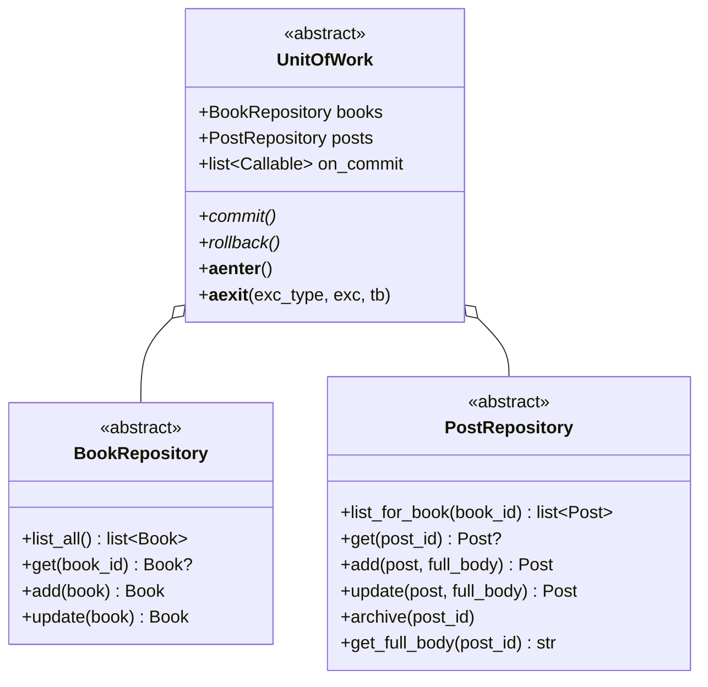

# Replacing the storage backend

A complete procedure for moving persistence from Notion to another store —
PostgreSQL, SQLite, MongoDB or anything else that can hold two collections of
records.

The architecture is arranged around this change. Persistence sits behind three
abstractions defined next to the domain, and a single contract suite defines
what any implementation must do. **No file in `domain/`, `application/` or
`interface/` needs to change.**

Budget: a working PostgreSQL adapter is roughly 300 lines of implementation plus
a fixture, against a contract suite that already exists.

---

## 1. What you are implementing

Three abstract classes in `backend/app/ports/`.



Ten methods. Every one accepts and returns **domain entities** — never rows,
documents or dictionaries. Storage-specific shapes must stop at your mapper.

### Semantics you must honour

| Method | Contract |
| --- | --- |
| `list_all` | Every book, any order. Ordering is the use case's concern |
| `books.get` | `None` for an unknown identifier, not an exception |
| `books.add` | Assign an identifier; return the stored entity |
| `books.update` | Fail loudly on an unknown identifier |
| `list_for_book` | Unarchived posts only, top-level and replies together, newest first |
| `posts.get` | Returns archived posts too |
| `posts.add` | Assign identifier and timestamps; return the stored entity |
| `posts.update` | Preserve `created_at`; refresh `edited_at` |
| `archive` | Soft-delete. The record must remain retrievable by identifier |
| `get_full_body` | The complete body, or the preview when `has_full_body` is false |

Two are easy to get wrong:

- **`archive` is not a delete.** `list_for_book` must exclude archived posts
  while `get` still returns them.
- **`add` and `update` take `full_body` as a separate parameter.** The entity
  carries only the preview and a flag. Storing the full body on the entity would
  defeat the mechanism that keeps feed rendering from loading every body.

### `on_commit`

A list of zero-argument callables invoked **after** a successful commit and
**never** after a rollback. The container registers cache invalidation here.
Two contract tests cover it. The base class provides `_fire_on_commit()`; call
it at the end of your `commit`.

---

## 2. Procedure

### Step 1 — Create the package

```text
backend/app/adapters/postgres/
├── __init__.py
├── schema.sql          or your migration tool of choice
├── mappers.py          rows ↔ entities
├── repositories.py     PostgresBookRepository, PostgresPostRepository
└── unit_of_work.py     PostgresUnitOfWork
```

Mirror the existing layout. `adapters/memory/store.py` is the shortest complete
reference implementation; read it before writing anything.

### Step 2 — Wire the contract suite first

Before implementing a single method, add the subclass. It will fail, and the
failures are your specification.

```python
# backend/tests/contract/test_postgres_unit_of_work.py
import pytest

from app.adapters.postgres import PostgresUnitOfWork
from tests.contract.test_unit_of_work_contract import UnitOfWorkContract


class TestPostgresUnitOfWork(UnitOfWorkContract):
    # A store with real transactions runs every test, including the three
    # that Notion has to skip.
    supports_transactions = True

    @pytest.fixture
    async def uow(self, clean_database):
        return PostgresUnitOfWork(clean_database)

    @pytest.fixture
    async def uow_factory(self, clean_database):
        return lambda: PostgresUnitOfWork(clean_database)
```

**Do not modify the contract.** If a test cannot pass, either the adapter is
wrong or the port is. Adding a fourth `fake_only` marker means stopping to
reconsider the port design, not adding the marker.

Setting `supports_transactions = True` activates three tests the Notion adapter
skips: `test_rollback_discards_an_added_post`,
`test_rollback_discards_an_update` and `test_rollback_restores_an_archived_post`.
Getting those green is the clearest signal the migration is real.

### Step 3 — Design the schema

Two tables or two collections. A minimal relational shape:

```sql
CREATE TABLE books (
    id              UUID PRIMARY KEY DEFAULT gen_random_uuid(),
    title           TEXT        NOT NULL CHECK (length(trim(title)) > 0),
    author          TEXT,
    status          TEXT        NOT NULL DEFAULT 'Upcoming',
    total_chapters  INTEGER     CHECK (total_chapters IS NULL OR total_chapters >= 1)
);

CREATE TABLE posts (
    id              UUID        PRIMARY KEY DEFAULT gen_random_uuid(),
    book_id         UUID        NOT NULL REFERENCES books(id),
    member          TEXT        NOT NULL,
    type            TEXT        NOT NULL,
    body_preview    TEXT        NOT NULL DEFAULT '',
    full_body       TEXT,
    chapter         INTEGER     CHECK (chapter IS NULL OR chapter >= 1),
    page            INTEGER     CHECK (page IS NULL OR page >= 1),
    parent_post_id  UUID        REFERENCES posts(id),
    archived        BOOLEAN     NOT NULL DEFAULT FALSE,
    created_at      TIMESTAMPTZ NOT NULL DEFAULT now(),
    edited_at       TIMESTAMPTZ NOT NULL DEFAULT now()
);

CREATE INDEX posts_book_created ON posts (book_id, created_at DESC)
    WHERE NOT archived;
```

Four decisions embedded there:

- **`full_body` is a nullable column, not a second table.** The preview/full-body
  split exists because Notion caps a text property at 2,000 characters. A store
  without that cap does not need the split at the storage layer — but the *port*
  keeps it, because the application relies on not loading bodies during feed
  rendering. Set `full_body` when `has_full_body` is true, `NULL` otherwise, and
  never select it in `list_for_book`.
- **`has_full_body` is derived**, not stored: `full_body IS NOT NULL`. Storing
  both invites them to disagree.
- **`archived` is a boolean**, and the partial index matches the query that
  matters.
- **`parent_post_id` is a real foreign key.** Notion cannot express this, which
  is why it uses plain text there. Use the constraint if you have it.

For a document store, one collection per entity with the same fields; index
`{ book_id: 1, archived: 1, created_at: -1 }`.

### Step 4 — Write the mappers

One function each way per entity. Keep every column or field name confined to
this module, exactly as the Notion mapper confines property names.

```python
def to_domain(row) -> Post:
    return Post(
        id=PostId(str(row["id"])),
        book_id=BookId(str(row["book_id"])),
        member=MemberName(row["member"]),
        type=PostType(row["type"]),
        body_preview=row["body_preview"],
        has_full_body=row["full_body"] is not None,
        position=Position(row["chapter"], row["page"]) if row["chapter"] else None,
        parent_post_id=PostId(str(row["parent_post_id"])) if row["parent_post_id"] else None,
        created_at=row["created_at"],
        edited_at=row["edited_at"],
    )
```

Be as forgiving as the Notion mapper only if records can be edited outside the
application. If the database is reachable only through this code, a constraint
violation should surface rather than be papered over.

### Step 5 — Implement the unit of work

This is where a transactional store earns its keep. The entire compensating
machinery disappears:

```python
class PostgresUnitOfWork(UnitOfWork):
    def __init__(self, pool):
        self._pool = pool
        self.on_commit = []

    async def __aenter__(self):
        self._connection = await self._pool.acquire()
        self._transaction = self._connection.transaction()
        await self._transaction.start()
        self.books = PostgresBookRepository(self._connection)
        self.posts = PostgresPostRepository(self._connection)
        return self

    async def __aexit__(self, exc_type, exc, tb):
        try:
            if exc_type is not None:
                await self.rollback()
        finally:
            await self._pool.release(self._connection)

    async def commit(self):
        await self._transaction.commit()
        self._fire_on_commit()

    async def rollback(self):
        await self._transaction.rollback()
```

Compare against `adapters/notion/unit_of_work.py`, which needs a compensation
stack, property capture before updates, reverse replay and error logging — about
90 lines that exist solely because Notion has no transactions.

Two requirements the contract enforces:

- `__aexit__` rolls back on an exception and **never** auto-commits.
- `commit` fires `on_commit` only on success.

### Step 6 — Wire the container

In `backend/app/composition.py`, `_build_uow` selects the implementation and
`startup`/`shutdown` manage the connection lifetime. Both are short and explicit
by design.

```python
async def startup(self) -> None:
    if self._uow_override is not None:
        return
    self._pool = await asyncpg.create_pool(self.settings.database_url)

async def shutdown(self) -> None:
    if self._pool is not None:
        await self._pool.close()
        self._pool = None

def _build_uow(self) -> UnitOfWork:
    if self._uow_override is not None:
        return self._uow_override()
    if self._pool is None:
        raise RuntimeError("Container.startup() has not run")
    return PostgresUnitOfWork(self._pool)
```

Add the connection setting to `backend/app/config.py` and
`backend/.env.example`, and drop the Notion settings once the migration is
complete.

### Step 7 — Verify

```bash
cd backend
.venv/bin/python -m pytest tests/contract -q     # the real gate
.venv/bin/python -m pytest -q                    # everything
.venv/bin/python scripts/check_coverage.py
```

The contract suite passing against the new adapter with
`supports_transactions = True` is the definition of done for the port work.

Then confirm nothing above the port noticed:

```bash
.venv/bin/python -m pytest tests/unit tests/api -q
```

These use the in-memory adapter and must pass **unchanged**. If they need
editing, an abstraction leaked and the leak should be fixed rather than the
tests.

---

## 3. Data migration

Only relevant if existing content must be preserved. The application layer
already gives you both halves, so no direct Notion access is required.

```python
import asyncio

from app.adapters.postgres import PostgresUnitOfWork
from app.composition import Container
from app.config import Settings


async def migrate(source: Container, target_pool) -> None:
    books = (await source.list_books().execute()).unwrap()

    async with PostgresUnitOfWork(target_pool) as target:
        id_map = {}
        for book in books:
            stored = await target.books.add(book)
            id_map[book.id] = stored.id

        for book in books:
            uow = source.uow_factory()()
            async with uow:
                posts = await uow.posts.list_for_book(book.id)
                bodies = {
                    post.id: await uow.posts.get_full_body(post.id)
                    for post in posts
                    if post.has_full_body
                }
            # Parents before replies, so parent references resolve.
            for post in sorted(posts, key=lambda p: (p.is_reply, p.created_at)):
                ...  # remap book_id and parent_post_id through id_map

        await target.commit()
```

Three things to plan for:

- **Identifiers change.** Keep a mapping and remap `book_id` and
  `parent_post_id` as you go.
- **Insert parents before replies** if you added a foreign key.
- **Full bodies need a fetch each.** Under a rate-limited source this is the slow
  part; run it once, offline, and keep the output.

---

## 4. What you can delete afterwards

| Path | Lines | Reason |
| --- | --- | --- |
| `app/adapters/notion/` | ~450 | Replaced |
| `tests/integration/` | ~600 | Notion-specific, including the stub |
| `tests/contract/test_notion_unit_of_work.py` | ~50 | Replaced by your subclass |
| `tests/fixtures/notion/` | — | Recorded responses |
| `scripts/verify_notion.py`, `scripts/capture_fixtures.py` | ~350 | Notion operator tools |
| Notion settings in `config.py` | ~5 | Replaced |
| The Notion property-name architecture test | ~60 | Adapt to your column names |

Also revisit, since each exists to work around a Notion constraint:

- **The 1,900-character preview limit** (`domain/entities.py`). The port keeps
  the preview/full-body split for feed-rendering cost, but the specific bound is
  a Notion property cap and can be chosen freely.
- **The 500-post feed cap** (`adapters/notion/repositories.py`). A store with
  real pagination can do better; the correct replacement is date-bounded queries
  rather than a larger cap.
- **The 20-second cache** (`application/caching.py`). Sized for a rate-limited
  remote API. Against a local database it may be unnecessary — but keep the
  `on_commit` hook if you keep the cache.
- **The token bucket and retry policy** (`adapters/notion/http.py`). Entirely
  Notion-specific.

---

## 5. Checklist

- [ ] New adapter package with three implementations
- [ ] Contract subclass added, `supports_transactions` set truthfully
- [ ] Contract suite green, **contract file unmodified**
- [ ] No fourth `fake_only` marker
- [ ] `tests/unit` and `tests/api` pass unchanged
- [ ] Column or field names confined to the adapter's mapper module
- [ ] `on_commit` fires after commit, never after rollback
- [ ] `__aexit__` rolls back on exception and does not auto-commit
- [ ] `archive` soft-deletes; `get` still returns archived records
- [ ] `list_for_book` does not load full bodies
- [ ] Container startup fails fast on an unreachable store
- [ ] Configuration and `.env.example` updated
- [ ] Coverage thresholds still met
- [ ] Notion-specific code and documentation removed

---

## 6. Design notes for the implementer

**Resist adding an ORM.** The ports return frozen dataclasses, and mapping rows
to them is a dozen lines per entity. An ORM introduces a second entity model
that will drift from the domain one, and the layering exists precisely to keep
persistence concerns from reaching the domain. If you add one, keep its models
inside the adapter package and map to domain entities at the boundary.

**Keep the repositories separate.** They stay distinct even though one unit of
work supplies both, so a use case that only reads books cannot reach posts.

**Do not widen the ports for convenience.** A method added for one caller has to
be implemented by every adapter, including the in-memory one, and the contract
suite grows accordingly. Ask whether the use case can compose existing methods
first.

**Fail fast at startup.** The container resolves connections during `startup`
rather than at first request, so a misconfiguration is a boot failure rather
than a runtime surprise.
